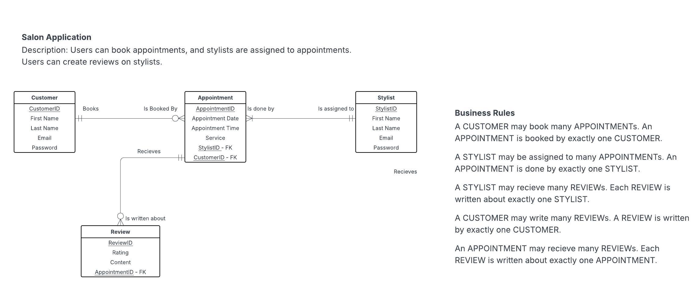
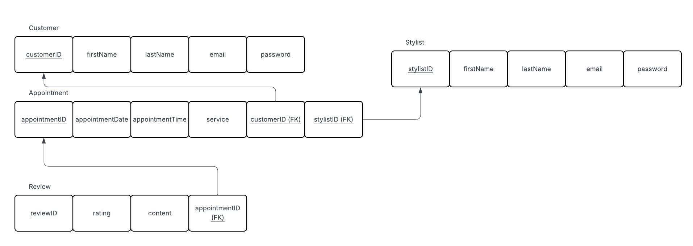

# Salon Application 💇‍♀️

This Salon Application is a web app that allows customers to create accounts, book appointments with stylists, and leave reviews based on their experiences. It’s designed to make scheduling process more effective while helping users discover top-rated stylists.

## Features 

### User accounts
- Users can sign up or log in to their accounts securely 

### Technologies Used 
- Frontend: HTML, CSS

## ERD Diagram

This Entity Relationship Diagram shows the relations between different entities, their attributes, and cardinalities. 

## Relations Diagram

This relations diagram shows how the entities from the ERD are translated into relational tables. Its purpose is to clearly define how the data will be structured and linked in the database before implementation. The relations in this design are in 1NF because there are no multivalued attributes and every attriubute is atomic. It is also in 2NF because each column is directly related to the primary key, and in 3NF because there are no transitive dependencies, as all non-key attributes are independant of eachother.

