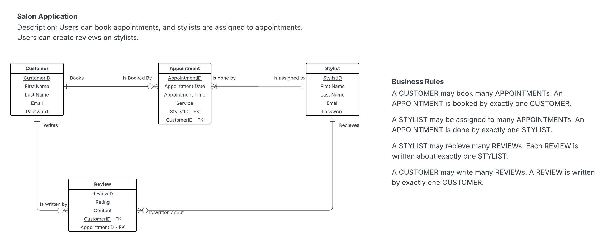

# Salon Application 💇‍♀️

This Salon Application is a web app that allows customers to create accounts, book appointments with stylists, and leave reviews based on their experiences. It’s designed to make scheduling process more effective while helping users discover top-rated stylists.

## Features 

### User accounts
- Users can sign up or log in to their accounts securely 

### Technologies Used 
- Frontend: HTML, CSS

## ERD Diagram

This Entity Relationship Diagram shows the relations between different entities, their attributes, and cardinalities. 

